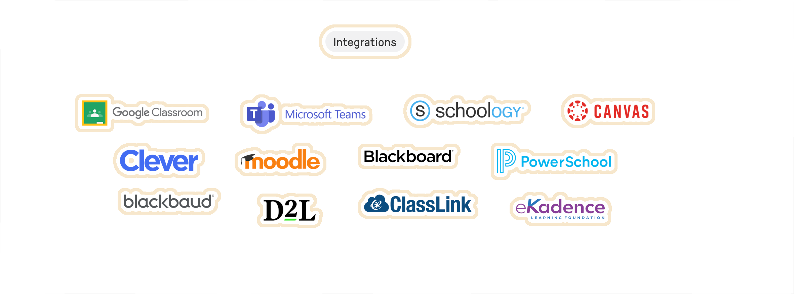

# index{style="--d:none"}

# Content{style="--d:none"}

{style="--maxw:60em; --m:2em auto 1em; --m-sm:10em auto 3em; --ta:center"}
# Sage.Education{style="--size:3.3em; --size-sm:6em"}

{style="--mb:50vh"}
## Spark Curiosity & Ignite Agency{style="--ta:center; --mb-sm:10rem"} 

Unlock limitless learning with Sage.Education.  {style="--size:1.6em; "} 

Harness AI's power and empower your students' futures.  {style="--size:1.6em; "}

### [Learn More!](#learn-more) {style="--ta:center"}

{style="--maxw: 80rem; --m:auto; --ta:center"}
## **Why Educators Are Choosing Sage.Education**{#learn-more}

### Other Education AI Platforms

 
- Security and Privacy
- Limited Innovation
- Shallow Learning

### How Sage. Education Works
- Data Security and Privacy
- Driver's Seat Approach
- Critical Thinking 
- Maker&#8209;Mindset

## Our System{.hidden}
 

{style="--d: flex; --fw: wrap; --bg: white; --p: 2em 0; --br: 12px; --shadow: 5; outline: rgb(230, 230, 230) dashed; outline-offset: -0.6em; --b-width: 2px; --maxw: 80rem; --m: 2em auto; --ai: center;"}
## **Why Students Love Sage** {style="--ta:center; --w: 100%"}

{style="--maxw: 90%; --maxw-md: 30%; --m: 0.6em auto; --minh:26ch; --bg: white; --p: 3em; --br: 12px; --shadow: 5; outline: rgb(230, 230, 230) dashed; outline-offset: -0.6em; --b-width: 2px; --ai: center; visibility: visible; animation-name: rotateInUpLeft;"}
##### Artifact View for Coding

Real-time feedback through our artifact view for CSS, HTML, and Javascript

{style="--maxw: 90%; --maxw-md: 30%; --m: 0.6em auto; --minh:26ch; --bg: white; --p: 3em; --br: 12px; --shadow: 5; outline: rgb(230, 230, 230) dashed; outline-offset: -0.6em; --b-width: 2px; --ai: center; visibility: visible; animation-name: rotateInUpLeft;"}
##### Integrated Media

Upload and integrate documents and websites for easy integration with Retrieval-Augmented Generation features

{style="--maxw: 90%; --maxw-md: 30%; --m: 0.6em auto; --minh:26ch; --bg: white; --p: 3em; --br: 12px; --shadow: 5; outline: rgb(230, 230, 230) dashed; outline-offset: -0.6em; --b-width: 2px; --ai: center; visibility: visible; animation-name: rotateInUpLeft;"}
##### Dialogue Branches

Track and review progress and decision-making with branching conversation views

## Create Learning Coachs{.hidden}
### Personalized Solutions

* **Train and Adapt**:
  Merge your expertise into ours for tailored learning.
  Adapt learning to individual progress.
* **Easy Training Tools**:
  User-friendly platforms for data science growth.
* **Learn and Share**:
  Community forum for collaboration and knowledge exchange.

### View your branching conversation maps

### See immediate creative artifacts{--fg:3}

* **Code Unleashed**:
  Unfurl your creations in lightning speed, with instant feedback on every click.
* **Building Blocks Unite**:
  Snap together AI components in an intuitive LEGO-style interface.
* **Train, Adapt, Unite**:
  Feed your AI with datasets and algorithms, shape it to perfection.

### Compare AI Assistants

* **Uncover Insights**:
  Contrast AI outputs to reveal hidden mistakes, biases, and results.
* **Unlock AI Potential**:
  Combine expertise to solve complex problems, and gain better results.
* **AI Systems**:
  Leverage multiple AI systems, enhance critical thinking, and drive informed decisions.

### Work with your own documents

{style="--d:none"}
## **A Better Way to Do Educational A.I.** {style="--ta:center"}

{style="--d:flex; --fw:wrap; --jc: center"}

 
### Ways{style="--d:none"}

  

{style="--maxw: 90%; --maxw-md: 30%; --m: 0.6em auto; --minh:26ch; --bg: white; --p: 3em; --br: 12px; --shadow-hvr: 5; outline: rgb(230, 230, 230) dashed; outline-offset: -0.6em; --b-width: 2px; --ai: center; visibility: visible; animation-name: rotateInUpLeft;"}
#### Tailored Learning for All

<a href="better_way#Tailored Learning for All"><button class="tag">Learn More</button></a>{hidden}

{style="--maxw: 90%; --maxw-md: 30%; --m: 0.6em auto; --minh:26ch; --bg: white; --p: 3em; --br: 12px; --shadow-hvr: 5; outline: #f7e7cc dashed; outline-offset: -0.6em; --b-width: 2px; --ai: center; visibility: visible; animation-name: rotateInUpLeft;"}
#### Empowering Teamwork Through AI

<a href="better_way#Empowering Teamwork Through AI"><button class="tag">Learn More</button></a>{hidden}

{style="--maxw: 90%; --maxw-md: 30%; --m: 0.6em auto; --minh:26ch; --bg: white; --p: 3em; --br: 12px; --shadow-hvr: 5; outline: rgb(230, 230, 230) dashed; outline-offset: -0.6em; --b-width: 2px; --ai: center; visibility: visible; animation-name: rotateInUpLeft;"}
#### Cutting-Edge Creativity 

<a href="better_way#Unleashing Creativity with Cutting-Edge Tools"><button class="tag">Learn More</button></a>{hidden}

{style="--maxw: 90%; --maxw-md: 30%; --m: 0.6em auto; --minh:26ch; --bg: white; --p: 3em; --br: 12px; --shadow-hvr: 5; outline: #f7e7cc dashed; outline-offset: -0.6em; --b-width: 2px; --ai: center; visibility: visible; animation-name: rotateInUpLeft;"}
#### Your Data is Yours to Control

<a href="better_way#Your Data, Your Control: Uncompromising Security"><button class="tag">Learn More</button></a>{hidden}

{style="--maxw: 90%; --maxw-md: 30%; --m: 0.6em auto; --minh:26ch; --bg: white; --p: 3em; --br: 12px; --shadow-hvr: 5; outline: rgb(230, 230, 230) dashed; outline-offset: -0.6em; --b-width: 2px; --ai: center; visibility: visible; animation-name: rotateInUpLeft;"}
#### Solutions for Tomorrow’s Classroom

<a href="better_way#Inclusive Solutions for Tomorrow’s Classroom"><button class="tag">Learn More</button></a>{hidden}

{style="--maxw: 90%; --maxw-md: 30%; --m: 0.6em auto; --minh:26ch; --bg: white; --p: 3em; --br: 12px; --shadow-hvr: 5; outline: rgb(230, 230, 230) dashed; outline-offset: -0.6em; --b-width: 2px; --ai: center; visibility: visible; animation-name: rotateInUpLeft;"}
#### See Sage. Education In Action!
<a href=""><button class="tag">Learn More</button></a>{hidden}

{style="--mt:4em"}
## Platform Integrations

{style="--m:auto; --shadow:none;outline: none; --scale:120%; --scale-hvr: 140%"}

## **Ed Tech Blog** {style="--ta:center"}

{style="--d:flex; --fw:wrap; --jc: center;--maxw: 80rem; --m:auto;"}

 
  
### Ways{style="--d:none"}

#### Principles of LLM Prompting for Teachers

<a href="/posts/blog/2024-09-26-principles-of-llm-prompting-for-teachers/"><button class="tag">Read More</button></a>

####  Be Nice to AI, It Might Just Make You Smarter

<a href="/posts/blog/2024-09-26-be-nice-to-ai-it-might-just-make-you-smarter/"><button class="tag">Read More</button></a>

#### Instructional Strategies and Prompting 

<a href="/posts/blog/2024-10-27-teaching-with-large-language-models-llms-strategies-for-high-school-educators/"><button class="tag " inactive>Read More</button></a>

{style="--d: flex; --fw: wrap; "}
### **The Right Solution For Schools** {style="--ta:center; --w: 100%"}

#### Protect privacy

Keeping students safe by complying with FERPA, COPPA, and GDPR.

#### Standardize content

Consolidate content and collaborate with other in your school.

#### Detailed feedback

See learners' conversations, engagements, and creative artifacts. 

{style="--m: 2em auto; --shadow:none; outline: none !important; --maxw: 80rem; --ta:center; --bg:none"}
### **Learning better with Sage.Education**
{style="--size:1em"}
#### Get Started Now!
 

<a href="/signup-now/">Signup</a>  -  
<a href="https://sage.startr.cloud"><button>Login</button></a>

	