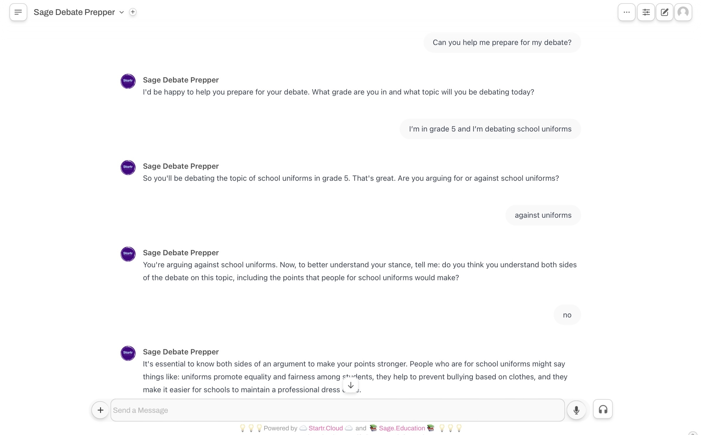
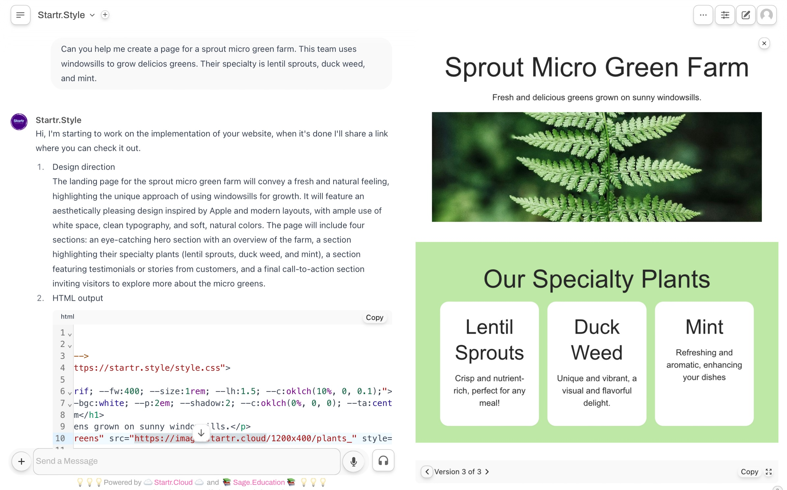
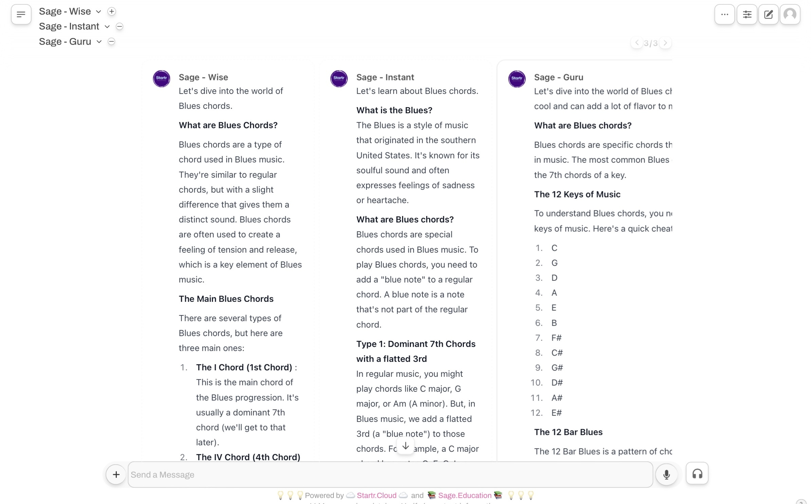
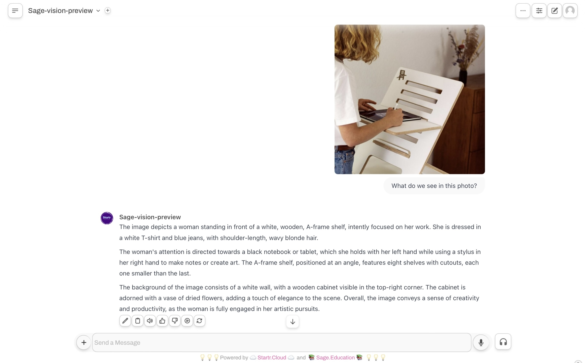

{style="--d:none"}
# index

{style="--maxw: 60rem; --m:auto;"}
# Content{style="--d:none"}
{style="--ta:center"}

{style="--bg: white; --p: 2em;  --m:2em auto;--br: 12px; --shadow: 5; outline: rgb(230, 230, 230) dashed; outline-offset: -0.6em; --b-width: 2px; --maxw: 66rem; --ai: center;"}
## Sage.Education Sparks Curiosity and Ignites Agency{style="--ta:center"} 

Unlock a world of limitless learning possibilities with Sage.Education. Empowering students and educators to creatively harness AI's power, we're transforming education for a brighter tomorrow. Join the movement and transform the future of learning.

### Get Started Now! {style="--ta:center"}

#### Customize your own learning coaches 

{style="--bg: white; --p: 2em; --br: 12px; --shadow: 5; outline: rgb(230, 230, 230) dashed; outline-offset: -0.6em; --b-width: 2px; --maxw: 66rem; --ai: center;"}

#### View your branching conversation maps:

{style="--bg: white; --p: 2em; --br: 12px; --shadow: 5; outline: rgb(230, 230, 230) dashed; outline-offset: -0.6em; --b-width: 2px; --maxw: 66rem; --ai: center;"}

#### See immediate creative artifacts:

{style="--bg: white; --p: 2em; --br: 12px; --shadow: 5; outline: rgb(230, 230, 230) dashed; outline-offset: -0.6em; --b-width: 2px; --maxw: 66rem; --ai: center;"}
#### Contrast AI assistant outputs:

{style="--bg: white; --p: 2em; --br: 12px; --shadow: 5; outline: rgb(230, 230, 230) dashed; outline-offset: -0.6em; --b-width: 2px; --maxw: 66rem; --ai: center;"}
#### Optimize with retrieval-augmented generation (RAG):

{style="--bg: white; --p: 2em; --br: 12px; --shadow: 5; outline: rgb(230, 230, 230) dashed; outline-offset: -0.6em; --b-width: 2px; --maxw: 66rem; --ai: center;"}
## **A Better Way to Do Educational A.I.** {style="--ta:center"}

{style="--d:flex; --fw:wrap; --jc: center"}

 
### Ways{style="--d:none"}

  

{style="--maxw: 90%; --maxw-md: 30%; --m: 0.6em auto; --minh:26ch; --bg: white; --p: 3em; --br: 12px; --shadow-hvr: 5; outline: rgb(230, 230, 230) dashed; outline-offset: -0.6em; --b-width: 2px; --ai: center; visibility: visible; animation-name: rotateInUpLeft;"}
#### Tailored Learning for All

<a href="better_way#Tailored Learning for All"><button class="tag">Learn More</button></a>{hidden}

{style="--maxw: 90%; --maxw-md: 30%; --m: 0.6em auto; --minh:26ch; --bg: white; --p: 3em; --br: 12px; --shadow-hvr: 5; outline: #f7e7cc dashed; outline-offset: -0.6em; --b-width: 2px; --ai: center; visibility: visible; animation-name: rotateInUpLeft;"}
#### Empowering Teamwork Through AI

<a href="better_way#Empowering Teamwork Through AI"><button class="tag">Learn More</button></a>{hidden}

{style="--maxw: 90%; --maxw-md: 30%; --m: 0.6em auto; --minh:26ch; --bg: white; --p: 3em; --br: 12px; --shadow-hvr: 5; outline: rgb(230, 230, 230) dashed; outline-offset: -0.6em; --b-width: 2px; --ai: center; visibility: visible; animation-name: rotateInUpLeft;"}
#### Cutting-Edge Creativity 

<a href="better_way#Unleashing Creativity with Cutting-Edge Tools"><button class="tag">Learn More</button></a>{hidden}

{style="--maxw: 90%; --maxw-md: 30%; --m: 0.6em auto; --minh:26ch; --bg: white; --p: 3em; --br: 12px; --shadow-hvr: 5; outline: #f7e7cc dashed; outline-offset: -0.6em; --b-width: 2px; --ai: center; visibility: visible; animation-name: rotateInUpLeft;"}
#### Your Data is Yours to Control

<a href="better_way#Your Data, Your Control: Uncompromising Security"><button class="tag">Learn More</button></a>{hidden}

{style="--maxw: 90%; --maxw-md: 30%; --m: 0.6em auto; --minh:26ch; --bg: white; --p: 3em; --br: 12px; --shadow-hvr: 5; outline: rgb(230, 230, 230) dashed; outline-offset: -0.6em; --b-width: 2px; --ai: center; visibility: visible; animation-name: rotateInUpLeft;"}
#### Solutions for Tomorrow’s Classroom

<a href="better_way#Inclusive Solutions for Tomorrow’s Classroom"><button class="tag">Learn More</button></a>{hidden}

{style="--maxw: 90%; --maxw-md: 30%; --m: 0.6em auto; --minh:26ch; --bg: white; --p: 3em; --br: 12px; --shadow-hvr: 5; outline: rgb(230, 230, 230) dashed; outline-offset: -0.6em; --b-width: 2px; --ai: center; visibility: visible; animation-name: rotateInUpLeft;"}
#### See Sage. Education In Action!
<a href=""><button class="tag">Learn More</button></a>{hidden}

{style="--mt:4em"}
## Platform Integrations{style="--ta:center"}

{style="--d: flex; --fw:wrap;--bg: white; --p: 2em; --br: 12px; --shadow: 5; outline: rgb(230, 230, 230) dashed; outline-offset: -0.6em; --b-width: 2px; --maxw: 66rem; --ai: center;"}
## The Right Solution For Educators {style="--ta:center; --fg:2"}

{style="--maxw: 90%; --maxw-md: 30%; --m: 0.6em auto; --minh:26ch; --bg: white; --p: 3em; --br: 12px; --shadow: 5; outline: rgb(230, 230, 230) dashed; outline-offset: -0.6em; --b-width: 2px; --ai: center; visibility: visible; animation-name: rotateInUpLeft;"}
#### Protect privacy

Keeping students safe by complying with FERPA, COPPA, and GDPR.

{style="--maxw: 90%; --maxw-md: 30%; --m: 0.6em auto; --minh:26ch; --bg: white; --p: 3em; --br: 12px; --shadow: 5; outline: rgb(230, 230, 230) dashed; outline-offset: -0.6em; --b-width: 2px; --ai: center; visibility: visible; animation-name: rotateInUpLeft;"}
#### Standardize content

Consolidate content and collaborate with other in your school.

{style="--maxw: 90%; --maxw-md: 30%; --m: 0.6em auto; --minh:26ch; --bg: white; --p: 3em; --br: 12px; --shadow: 5; outline: rgb(230, 230, 230) dashed; outline-offset: -0.6em; --b-width: 2px; --ai: center; visibility: visible; animation-name: rotateInUpLeft;"}
#### Get detailed feedback

See learners' conversations, engagements, and creative artifacts. 

{style="--d: flex; --fw: wrap; --bg: white; --p: 2em 0; --br: 12px; --shadow: 5; outline: rgb(230, 230, 230) dashed; outline-offset: -0.6em; --b-width: 2px; --maxw: 60rem; --m: 2em auto; --ai: center;"}
## **Why Students Love Sage** {style="--ta:center; --w: 100%"}

{style="--maxw: 90%; --maxw-md: 30%; --m: 0.6em auto; --minh:26ch; --bg: white; --p: 3em; --br: 12px; --shadow: 5; outline: rgb(230, 230, 230) dashed; outline-offset: -0.6em; --b-width: 2px; --ai: center; visibility: visible; animation-name: rotateInUpLeft;"}
#### Artifact View for Coding

Real-time feedback through our artifact view for CSS, HTML, and Javascript

{style="--maxw: 90%; --maxw-md: 30%; --m: 0.6em auto; --minh:26ch; --bg: white; --p: 3em; --br: 12px; --shadow: 5; outline: rgb(230, 230, 230) dashed; outline-offset: -0.6em; --b-width: 2px; --ai: center; visibility: visible; animation-name: rotateInUpLeft;"}
#### Multimedia Integration

Upload and integrate documents and websites for easy integration with Retrieval-Augmented Generation features

{style="--maxw: 90%; --maxw-md: 30%; --m: 0.6em auto; --minh:26ch; --bg: white; --p: 3em; --br: 12px; --shadow: 5; outline: rgb(230, 230, 230) dashed; outline-offset: -0.6em; --b-width: 2px; --ai: center; visibility: visible; animation-name: rotateInUpLeft;"}
#### Branching Conversation Overview

Track and review progress and decision-making with branching conversation views

{style="--maxw: 60rem; --m:auto; --ta:center"}
## **Why Educators Are Choosing Sage.Education**

### Other Education AI Platforms Red Flags

 
- Security and Privacy Concerns
- Limited Innovation
- Shallow Learning

### How Sage.Education Works
- Data Security and Privacy
- Driver's Seat Approach
- Critical Thinking and Maker-Mindset

## **Ed Tech Blog** {style="--ta:center"}

{style="--d:flex; --fw:wrap; --jc: center;--maxw: 60rem; --m:auto;"}

 
  
### Ways{style="--d:none"}

{style="--maxw: 90%; --maxw-md: 30%; --m: 0.6em auto; --minh:26ch; --bg: white; --p: 3em; --br: 12px; --shadow-hvr: 5; outline: rgb(230, 230, 230) dashed; outline-offset: -0.6em; --b-width: 2px; --ai: center; visibility: visible; animation-name: rotateInUpLeft;"}
#### Principles of LLM Prompting for Teachers

<a href=https://sage.education/posts/blog/2024-09-26-principles-of-llm-prompting-for-teachers/><button class="tag">Read More</button></a>

{style="--maxw: 90%; --maxw-md: 30%; --m: 0.6em auto; --minh:26ch; --bg: white; --p: 3em; --br: 12px; --shadow-hvr: 5; outline: #f7e7cc dashed; outline-offset: -0.6em; --b-width: 2px; --ai: center; visibility: visible; animation-name: rotateInUpLeft;"}
####  Be Nice to AI, It Might Just Make You Smarter

<a href=https://sage.education/posts/blog/2024-09-26-be-nice-to-ai-it-might-just-make-you-smarter/><button class="tag">Read More</button></a>

{style="--maxw: 90%; --maxw-md: 30%; --m: 0.6em auto; --minh:26ch; --bg: white; --p: 3em; --br: 12px; --shadow-hvr: 5; outline: rgb(230, 230, 230) dashed; outline-offset: -0.6em; --b-width: 2px; --ai: center; visibility: visible; animation-name: rotateInUpLeft;"}
#### Instructional Strategies and Prompting 

<a href=https://sage.education/><button class="tag " inactive>Read More</button></a>

{style="--m: 2em auto; --maxw: 60rem; "}
### **Learning better with Sage.Education**{style="--m: 2em auto"}
#### Get Started Now!
 
[Signup](https://sage.startr.cloud)  -  [<button class="tag">Login</button>](https://sage.startr.cloud)

